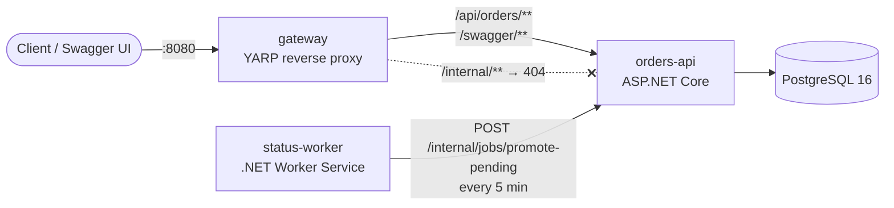
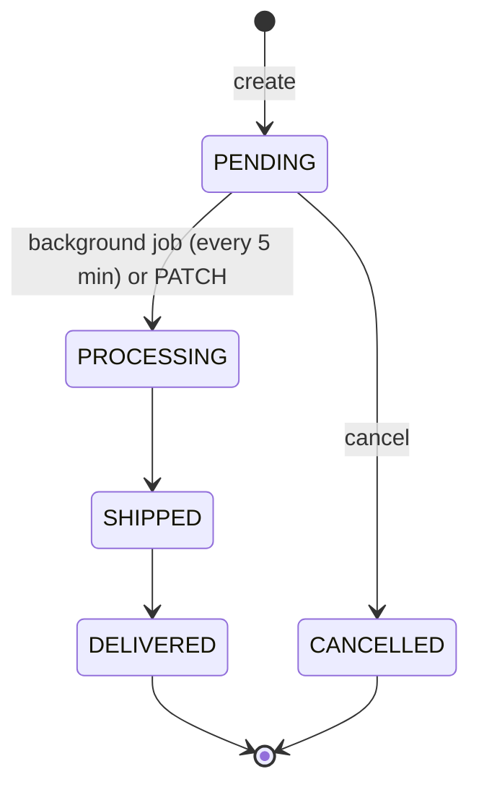

# E-commerce Order Processing System

The backend for an e-commerce order processing system, built with **.NET 8** as two microservices behind an API gateway. One command starts everything:

```bash
docker compose up --build
```

Then open **http://localhost:8080/swagger**.

| Requirement | Where it lives |
|---|---|
| Create an order with multiple items | `POST /api/orders` |
| Retrieve order details by ID | `GET /api/orders/{id}` |
| Status lifecycle PENDING → PROCESSING → SHIPPED → DELIVERED | `PATCH /api/orders/{id}/status`, enforced by a domain state machine |
| Background job: PENDING → PROCESSING every 5 minutes | `status-worker` service (`PeriodicTimer`, 300 s) |
| List all orders, optionally filtered by status | `GET /api/orders?status=PENDING` (paged; can also filter by `customerId`) |
| Cancel only while PENDING | `POST /api/orders/{id}/cancel` → `409` otherwise |

**Documentation map**
- **The plan approved before any code was written** (the first commit): [docs/00-approved-plan.md](docs/00-approved-plan.md)
- **How the code works** (folder structure, request flows, where each requirement lives, demo script, likely questions): [docs/technical-walkthrough.md](docs/technical-walkthrough.md)
- **How AI was used across the SDLC**, and how the evidence files were planned and created: [docs/ai-sdlc-process.md](docs/ai-sdlc-process.md)
- **How it was built**, one file per SDLC stage including how AI was used: [`docs/01-planning.md` … `06-reflection.md`](docs/). See [How AI was used](#how-ai-was-used).

---

## Architecture



| Service | Responsibility | Exposed |
|---|---|---|
| `gateway` | The single public entry point. Routes `/api/orders/**` and `/swagger/**`, adds or propagates `X-Correlation-Id`, and actively health-checks orders-api. | `localhost:8080` |
| `orders-api` | Owns the order data and every business rule. Clean architecture: Domain / Application / Infrastructure / Api. | private network only |
| `status-worker` | Runs the scheduled job. It owns no data; it triggers the promote use case over HTTP, with retry and circuit breaker. | none |
| `postgres` | Storage, accessed only by orders-api. | private network only |

**Why the worker calls the API instead of the database:** only one service writes to the orders database, so the rules and the concurrency handling live in one place, and there's no shared-database coupling between services. The promote endpoint runs a single set-based `UPDATE … WHERE status = 'Pending'`. That makes it **idempotent**, so retries and multiple worker replicas are safe.

**Cancel vs. background job race:** every order has a `Version` concurrency token, and the job rotates it. If a cancel reads an order while it's PENDING but the job promotes the order before the cancel is saved, the cancel fails with `409 Concurrent update` instead of silently overwriting PROCESSING. A deterministic integration test covers this (`ConcurrencyTests`).

### Order lifecycle



Any other transition returns `409 Conflict`. CANCELLED isn't in the original status list; it was added because a cancelled order needs a state of its own (see [docs/01-planning.md](docs/01-planning.md)).

---

## Running it locally

### Prerequisites

| To… | You need |
|---|---|
| Run the system (Option A) | **Docker** with Compose v2 (Docker Desktop on Windows/macOS, or Docker Engine on Linux/WSL). No .NET SDK needed. |
| Run the services from source, or run the tests (Option B) | **.NET 8 SDK** + Docker (for PostgreSQL and the integration tests) |
| Run the smoke test | `bash` + `curl` (Linux, macOS, WSL or Git Bash on Windows) |

```bash
git clone <repo-url> Order-Processing-System
cd Order-Processing-System
```

### Option A: everything in Docker (recommended)

```bash
docker compose up --build -d          # build images, start postgres → orders-api → status-worker + gateway
docker compose ps                     # wait until gateway, orders-api and postgres show (healthy), about 20 s
```

Then:

| What | Where |
|---|---|
| Swagger UI (try every endpoint) | http://localhost:8080/swagger |
| Health | http://localhost:8080/health |
| Sample requests | [`requests/orders.http`](requests/orders.http) (VS Code REST Client, Rider, Visual Studio) |

```bash
./scripts/smoke-test.sh               # 23 end-to-end checks through the gateway
docker compose logs -f status-worker  # watch the background job
docker compose logs -f orders-api     # API logs (each line carries a correlation id)
docker compose down                   # stop (keeps data)
docker compose down -v                # stop and delete the database volume
```

**Seeing the background job quickly.** The default interval is the required 5 minutes. For a demo, shorten it:

```bash
WORKER_INTERVAL_SECONDS=30 docker compose up --build -d
WAIT_FOR_WORKER=1 ./scripts/smoke-test.sh   # also waits until a PENDING order becomes PROCESSING
```

On Windows PowerShell, set the variable first (`$env:WORKER_INTERVAL_SECONDS=30; docker compose up --build -d`), or copy `.env.example` to `.env` and edit it. That works the same on every OS.

### Option B: run the services from source (for development and debugging)

Start only PostgreSQL in Docker, then run each service with the .NET SDK, each in its own terminal (or from Visual Studio / Rider):

```bash
docker run -d --name orders-db -p 5432:5432 \
  -e POSTGRES_DB=orders -e POSTGRES_USER=orders -e POSTGRES_PASSWORD=orders_dev_password \
  postgres:16-alpine

dotnet run --project src/Services/Orders/OrderProcessing.Orders.Api          # http://localhost:5001/swagger (creates tables on start)
dotnet run --project src/Gateway/OrderProcessing.Gateway                     # http://localhost:8080/swagger
dotnet run --project src/Services/StatusWorker/OrderProcessing.StatusWorker -- --Worker:IntervalSeconds=30
```

No configuration is needed: the default `appsettings.json` files already point at `localhost` (database 5432, API 5001, gateway 8080). When finished: `docker rm -f orders-db`.

### Running the tests

```bash
dotnet test                                              # all 136 tests; Docker must be running
dotnet test tests/OrderProcessing.Orders.UnitTests       # unit tests only, no Docker needed
dotnet test --filter FullyQualifiedName~ConcurrencyTests # a single test class
```

The integration tests start their own throwaway PostgreSQL container (Testcontainers), so you don't need to start a database for them.

### Troubleshooting

| Symptom | Fix |
|---|---|
| `port is already allocated` on 8080 | Another app uses it. Run `GATEWAY_PORT=8090 docker compose up -d` and open `http://localhost:8090/swagger` |
| Option B: port 5432 already in use | A local PostgreSQL is running. Stop it, or map `-p 5433:5432` and run the API with `--ConnectionStrings:OrdersDb="Host=localhost;Port=5433;Database=orders;Username=orders;Password=orders_dev_password"` |
| `orders-api` never becomes healthy | `docker compose logs orders-api`. Usually the database isn't ready yet (it retries) or the password differs from an old volume (`docker compose down -v`). |
| `./scripts/smoke-test.sh: Permission denied` | `chmod +x scripts/smoke-test.sh`, or run `bash scripts/smoke-test.sh` |
| `dotnet test` fails with Docker errors | Start Docker Desktop / the Docker daemon; the integration tests need it |
| Order stays PENDING | Expected for up to 5 minutes. Use `WORKER_INTERVAL_SECONDS=30` for demos. |

### Configuration

| Setting (env var, or `.env`; see `.env.example`) | Default | Meaning |
|---|---|---|
| `WORKER_INTERVAL_SECONDS` | `300` | How often PENDING orders are promoted |
| `WORKER_RUN_ON_STARTUP` | `false` | Also run once as soon as the worker starts |
| `MIN_PENDING_AGE_SECONDS` | `0` | Only promote orders at least this old. Gives customers a guaranteed cancellation window. |
| `GATEWAY_PORT` | `8080` | Host port for the gateway |
| `POSTGRES_PASSWORD` | `orders_dev_password` | Database password (development only) |

---

## API

Base URL: `http://localhost:8080`. Statuses are strings: `PENDING`, `PROCESSING`, `SHIPPED`, `DELIVERED`, `CANCELLED`. Errors use RFC 7807 `application/problem+json`.

| Method | Path | Success | Errors |
|---|---|---|---|
| `POST` | `/api/orders` | `201` + `Location` | `400` validation |
| `GET` | `/api/orders/{id}` | `200` | `404` |
| `GET` | `/api/orders?status=&customerId=&page=1&pageSize=20` | `200` paged, newest first | `400` invalid filter or paging |
| `PATCH` | `/api/orders/{id}/status` body `{"status":"SHIPPED"}` | `200` | `400`, `404`, `409` illegal transition |
| `POST` | `/api/orders/{id}/cancel` | `200` | `404`, `409` not PENDING |
| `GET` | `/health` | `200 Healthy` | |

```bash
curl -X POST http://localhost:8080/api/orders -H 'Content-Type: application/json' -d '{
  "customerId": "cust-1001",
  "items": [
    { "productId": "SKU-KEYBOARD", "productName": "Mechanical keyboard", "quantity": 1, "unitPrice": 89.99 },
    { "productId": "SKU-MOUSE",    "productName": "Wireless mouse",      "quantity": 2, "unitPrice": 24.50 }
  ]
}'
```

```json
{
  "id": "3436f02e-a8f4-46f4-9539-dc4d05a8704b",
  "customerId": "cust-1001",
  "status": "PENDING",
  "totalAmount": 138.99,
  "createdAt": "2026-10-02T09:45:12.345+00:00",
  "updatedAt": "2026-10-02T09:45:12.345+00:00",
  "items": [
    { "id": "…", "lineNumber": 1, "productId": "SKU-KEYBOARD", "productName": "Mechanical keyboard", "quantity": 1, "unitPrice": 89.99, "lineTotal": 89.99 },
    { "id": "…", "lineNumber": 2, "productId": "SKU-MOUSE", "productName": "Wireless mouse", "quantity": 2, "unitPrice": 24.50, "lineTotal": 49.00 }
  ]
}
```

**Validation rules:**
- At least 1 and at most 100 items, and each product appears only once (case- and whitespace-insensitive).
- Quantity is between 1 and 10,000.
- Unit price is greater than 0 and at most 1,000,000, with at most 2 decimal places.
- `customerId` and `productId` are each at most 64 characters.
- The server always calculates the total; it never trusts one from the client.

---

## Project layout

```
src/
  Gateway/OrderProcessing.Gateway/                 YARP config-driven routes, correlation id
  BuildingBlocks/OrderProcessing.BuildingBlocks/   correlation-id middleware, Serilog setup (web services)
  Services/Orders/
    OrderProcessing.Orders.Domain/                 Order aggregate, OrderItem, OrderStatus state machine
    OrderProcessing.Orders.Application/            OrderService use cases, contracts, FluentValidation
    OrderProcessing.Orders.Infrastructure/         EF Core + Npgsql, repository, migrations
    OrderProcessing.Orders.Api/                    controllers, ProblemDetails handler, Swagger, health
  Services/StatusWorker/OrderProcessing.StatusWorker/  BackgroundService + typed HttpClient
tests/
  OrderProcessing.Orders.UnitTests/                domain, state machine (all 25 pairs), service, validators
  OrderProcessing.Orders.IntegrationTests/         real API + real PostgreSQL (Testcontainers), race conditions
  OrderProcessing.StatusWorker.UnitTests/          schedule with FakeTimeProvider, HTTP client
scripts/smoke-test.sh                              end-to-end checks against docker compose
docs/01-planning.md … 06-reflection.md             SDLC evidence and AI usage log
```

## Design patterns used

| Pattern | Where |
|---|---|
| Clean / layered architecture | Domain ← Application ← Infrastructure / Api |
| Aggregate root (DDD) | `Order` owns its `OrderItem`s; all changes go through its methods |
| State machine | `OrderStatusTransitions`, the single source of truth for legal transitions |
| Repository + unit of work | `IOrderRepository` (EF `DbContext` underneath) |
| Optimistic concurrency | `Order.Version` concurrency token (lost-update protection) |
| Background / hosted service | `PendingOrderPromotionWorker : BackgroundService` with `PeriodicTimer` |
| API gateway | YARP; the only public entry point, hides `/internal/**` |
| Typed HttpClient + Retry + Circuit Breaker | `OrdersApiClient` with `AddStandardResilienceHandler` |
| Options pattern (validated on start) | `WorkerOptions`, `OrderProcessingOptions` |
| Centralised error handling | `GlobalExceptionHandler` → ProblemDetails |
| Dependency injection, `TimeProvider` abstraction | Everywhere; makes time-based logic testable |

## Testing

```bash
dotnet test                  # needs the .NET 8 SDK and Docker (for Testcontainers)
./scripts/smoke-test.sh      # against the running compose stack
```

| Suite | Tests | What it covers |
|---|---|---|
| Orders.UnitTests | 86 | Order invariants; every one of the 25 status transition pairs; cancel rules; service use cases with a fake clock; validators |
| Orders.IntegrationTests | 42 | Full HTTP API on real PostgreSQL: happy paths, 400/404/409 cases, paging, the promote job, the cancel-vs-job race, concurrent cancels, the forwarded Location header, correlation id |
| StatusWorker.UnitTests | 8 | 5-minute schedule on `FakeTimeProvider` (no real waiting), recovery after a failed run, clean shutdown, HTTP contract |
| `smoke-test.sh` | 23 (+1 with the worker wait) | The real Docker stack through the gateway, including `/internal` being blocked |

GitHub Actions ([`.github/workflows/ci.yml`](.github/workflows/ci.yml)) runs the unit and integration tests, then brings up the compose stack and runs the smoke test. Details and real results: [docs/04-testing.md](docs/04-testing.md).

## How AI was used

AI (Claude Code, in VS Code) was used at every SDLC stage, as the slides describe. Each important interaction is logged with its **context → AI suggestion → Accept / Modify / Reject → verification**:

| Stage | Evidence | Highlights |
|---|---|---|
| 1. Understand / plan | [01-planning.md](docs/01-planning.md) | Clarifying questions; ambiguities found (missing CANCELLED state, job semantics, money rules) |
| 2. Design | [02-design.md](docs/02-design.md) | Options compared (shared DB vs API call, SQLite vs Testcontainers, …) and trade-offs chosen |
| 3. Build | [03-build.md](docs/03-build.md) | AI output inspected; issues caught before and after running |
| 4. Test | [04-testing.md](docs/04-testing.md) | Test matrix, mutation checks proving the tests can fail, smoke-test bugs |
| 5. Review | [05-review.md](docs/05-review.md) | 10 AI review findings: 9 verified and fixed (6 reproduced live first), 1 rejected with a reason |
| 6. Reflect | [06-reflection.md](docs/06-reflection.md) | Decisions, rework and lessons |

Notable issues AI introduced or missed, and how each was corrected:
- **First-pass logging fix was too broad.** It silenced a whole framework log category, which would have hidden real errors. The AI review caught it and it was replaced with a targeted filter.
- **The AI-written smoke-test script had a greedy regex.** It read an item's id instead of the order's id, so most checks failed. Worse, one check passed for the wrong reason.
- **Several real bugs found only through review and reproduction:**
  - the internal hostname leaked in the `Location` header;
  - integer overflow on `page`;
  - `numeric(18,2)` overflow;
  - a 404 turned into a 500 for non-JSON clients;
  - non-deterministic item order.

## Not in scope / next steps

Authentication and authorization, idempotency keys on `POST /api/orders`, a product catalog and inventory service, events and the outbox pattern (for example, publishing `OrderCancelled`), OpenTelemetry tracing, rate limiting at the gateway, and keyset pagination for very large tables. See [docs/06-reflection.md](docs/06-reflection.md).
