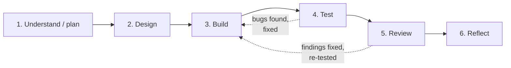

# How AI was used across the SDLC

This explains the **process**: how AI was used at each stage, what the developer did at each checkpoint, and how the evidence files `01`–`06` were planned and created. The individual decisions and issues are logged in the stage files themselves.

## 1. Setup

| Item | Detail |
|---|---|
| AI tool | **Claude Code** (model Claude Opus 5.5), running in VS Code against the WSL project folder |
| What the AI could do | Read and write files, run terminal commands (dotnet, docker, git), ask clarifying questions, and run a code-review skill |
| Input given to the AI | The assignment text, the two course slides ("Use AI at every SDLC stage", "Work through the SDLC"), and the request: *complete working solution, maybe microservices, Docker Compose so it can be shown easily* |
| Process followed | The slides: **spec → plan → design → build → test → review**, each stage producing an input for the next and evidence that can be reviewed |



## 2. Stage by stage: AI action, developer checkpoint, evidence

| Stage | What the AI did | Developer checkpoint (from the slide) | What was produced | Evidence |
|---|---|---|---|---|
| **1. Understand / plan** | Started in **plan mode** (read-only, no code changes allowed). Asked 3 multiple-choice scoping questions with a recommendation each. Listed ambiguities (missing CANCELLED status, job timing, money rules, the cancel-vs-job race) and acceptance criteria. Wrote an implementation plan. | **Approve a testable feature spec.** The developer answered the questions (.NET 8, 2 services + gateway, Swagger only) and **approved the plan** before any code was written. | Plan + acceptance criteria | [01-planning.md](01-planning.md) |
| **2. Design** | Compared options with trade-offs: shared DB vs API call, conditional update vs concurrency token vs locks, SQLite vs Testcontainers, YARP vs Nginx | **Choose an approach and trade-offs.** The service split was chosen by the developer; the remaining design choices were in the approved plan. | Architecture, data model, concurrency + test strategy | [02-design.md](02-design.md) |
| **3. Build** | Implemented inside out (domain → application → infrastructure → API → worker → gateway → Docker). Built and tested after each layer and committed working steps. Inspected its own output and corrected issues before running (e.g. the `{}` body binding to PENDING). | **Inspect and adjust the changes.** Mostly done by the AI on its own output; developer review of the code is still recommended (see §5). | Working code in 6 commits | [03-build.md](03-build.md) |
| **4. Test** | Proposed and wrote 136 tests (unit, integration on real Postgres, worker with a fake clock) plus a smoke script. Ran the real Docker stack, which exposed 2 bugs. **Deliberately broke the code** to prove the tests catch it. | **Run tests and verify findings.** The tests were run by the AI; the outputs are pasted in the evidence file. | Test matrix + real results | [04-testing.md](04-testing.md) |
| **5. Review** | Ran a targeted AI code review (10 findings). **Reproduced each finding on the running stack before fixing it**, added regression tests, and rejected 1 finding with a reason. | **Verify each material finding.** Each verification command and its before/after result is recorded so it can be re-run. | 9 fixes, 1 rejection | [05-review.md](05-review.md) |
| **6. Reflect** | Reconstructed decisions, rework and lessons from the git history and the stage logs | **Explain learning and next improvement.** **Must be written by the developer**; the AI version is a marked draft. | Draft reflection | [06-reflection.md](06-reflection.md) |

## 3. How the evidence files were planned

**Where the structure came from:** the second slide defines six files, one per stage, and its footer gives the logging rule: *"For important AI interactions: record context, suggestion, Accept / Modify / Reject decision and verification."*

The plan therefore fixed the same layout for every file:

```
# 0N · <Stage name>
**Stage goal:** <the "participant action" from the slide>

<stage-specific content: tables of decisions, issues, results>

## AI interaction log
| Context | AI suggestion | Decision (Accept / Modify / Reject) | Verification |
```

| File | Stage-specific content planned for it |
|---|---|
| 01-planning | Requirements restated, ambiguities and how each was resolved, the developer's scope choices, acceptance criteria with the test that proves each |
| 02-design | Options considered vs. chosen, data model, concurrency design, API and job design, test strategy |
| 03-build | Build sequence by commit, environment problems, issues found in AI-generated code and how each was corrected |
| 04-testing | Test pyramid, normal / invalid / edge-case matrix, real command output, mutation checks, bugs found by testing |
| 05-review | How the review was run, each finding with how it was verified, the before/after result and the decision, security notes |
| 06-reflection | Human decisions, where AI helped, where AI was wrong, rework, next improvements |

**What counts as "important":** an interaction gets a log row if it changed the design, if the AI output was wrong or modified, or if a decision needs defending in the walkthrough. Routine generation that was accepted unchanged and passed its tests isn't logged line by line.

## 4. How the evidence files were created

To be precise about timing:

1. **During the build**, every issue was recorded at the moment it happened: in commit messages (e.g. the review-fix commit lists F1–F10), in the test and terminal output, and in notes kept during the session.
2. **After the build was complete**, the six files were written in one pass from that material: `git log`, the saved command output, test results and review findings. Every number in them (test counts, coverage, smoke results) comes from a real run, and nothing was invented.
3. **The slide asks for the files to be updated *while* building each feature.** That wasn't done: they were compiled at the end, and the five API features were built in one cycle rather than one loop per feature. [03-build.md](03-build.md) and [01-planning.md](01-planning.md) state this deviation.

## 5. Rules applied to AI output

| Rule | Example from this project |
|---|---|
| AI output is a draft until verified | All 10 review findings checked first; 6 reproduced live; 1 rejected |
| Prove the tests can fail | Two deliberate code breaks, both caught |
| Record real issues only, including AI's own mistakes | Greedy regex in the AI-written smoke script; a too-broad logging fix; a verification grep that could never match |
| The developer owns the decisions and the reflection | Scope chosen by the developer; 06-reflection is marked for rewriting in the developer's own words |

**Still open for the developer** (to make the checkpoint column fully true):
- [ ] Run `dotnet test` and `./scripts/smoke-test.sh` yourself
- [ ] Reproduce at least two review findings yourself (commands are in 05-review)
- [ ] Read `Order.cs`, `OrderStatusTransitions.cs`, `OrderRepository.cs` and `PendingOrderPromotionWorker.cs`, and be able to explain them
- [ ] Rewrite 06-reflection in your own words

## 6. Applying the process to the next feature

To follow the slide exactly for any new feature (e.g. an `Idempotency-Key` on create), run one full loop and **update the files as you go**:

1. **Plan:** ask AI for edge cases and acceptance criteria → approve them → add a section to `01-planning.md`.
2. **Design:** ask AI for 2–3 options → choose one → add the trade-off to `02-design.md`.
3. **Build:** implement only that feature → inspect the diff → log changes and corrections in `03-build.md`.
4. **Test:** add normal, invalid and edge tests → run them → paste the results into `04-testing.md`.
5. **Review:** ask AI to review only that diff → verify each finding → log it in `05-review.md`.
6. **Reflect:** one paragraph in `06-reflection.md`. Then commit.
