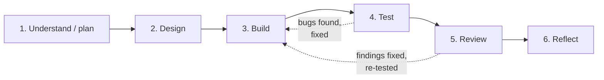

# How AI was used across the SDLC

This explains the **process**: how AI was used at each stage, what the developer did at each checkpoint, and how the evidence files `01`–`06` were planned and created. The individual decisions and issues are logged in the stage files themselves.

## 1. Setup

| Item | Detail |
|---|---|
| AI tool | **Claude Code** (model Claude Opus 5.5), running in VS Code against the WSL project folder |
| What the AI could do | Read and write files, run terminal commands (dotnet, docker, git), ask clarifying questions, and run a code-review skill |
| Input given to the AI | The assignment text, the two course slides ("Use AI at every SDLC stage", "Work through the SDLC"), and the request: *complete working solution, maybe microservices, Docker Compose so it can be shown easily* |
| Process followed | The slides: **spec → plan → design → build → test → review**, each stage producing an input for the next and evidence that can be reviewed |



## 2. Stage by stage: AI action, developer checkpoint, evidence

| Stage | What the AI did | Developer checkpoint (from the slide) | What was produced | Evidence |
|---|---|---|---|---|
| **1. Understand / plan** | Started in **plan mode** (read-only, no code changes allowed). Asked 3 multiple-choice scoping questions with a recommendation each. Listed ambiguities (missing CANCELLED status, job timing, money rules, the cancel-vs-job race) and acceptance criteria. Wrote an implementation plan. | **Approve a testable feature spec.** The developer answered the questions (.NET 8, 2 services + gateway, Swagger only) and **approved the plan** before any code was written. | Plan + acceptance criteria | [00-approved-plan.md](00-approved-plan.md) (the original plan), [01-planning.md](01-planning.md) |
| **2. Design** | Compared options with trade-offs: shared DB vs API call, conditional update vs concurrency token vs locks, SQLite vs Testcontainers, YARP vs Nginx | **Choose an approach and trade-offs.** The service split was chosen by the developer; the remaining design choices were in the approved plan. | Architecture, data model, concurrency + test strategy | [02-design.md](02-design.md) |
| **3. Build** | Implemented inside out (domain → application → infrastructure → API → worker → gateway → Docker). Built and tested after each layer and committed working steps. Inspected its own output and corrected issues before running (e.g. the `{}` body binding to PENDING). | **Inspect and adjust the changes.** Mostly done by the AI on its own output; developer review of the code is still recommended (see §6). | Working code in 4 commits | [03-build.md](03-build.md) |
| **4. Test** | Proposed and wrote 136 tests (unit, integration on real Postgres, worker with a fake clock) plus a smoke script. Ran the real Docker stack, which exposed 2 bugs. **Deliberately broke the code** to prove the tests catch it. | **Run tests and verify findings.** The tests were run by the AI; the outputs are pasted in the evidence file. | Test matrix + real results | [04-testing.md](04-testing.md) |
| **5. Review** | Ran a targeted AI code review (10 findings). **Reproduced each finding on the running stack before fixing it**, added regression tests, and rejected 1 finding with a reason. | **Verify each material finding.** Each verification command and its before/after result is recorded so it can be re-run. | 9 fixes, 1 rejection | [05-review.md](05-review.md) |
| **6. Reflect** | Reconstructed decisions, rework and lessons from the git history and the stage logs | **Explain learning and next improvement.** **Must be written by the developer**; the AI version is a marked draft. | Draft reflection | [06-reflection.md](06-reflection.md) |

## 3. Files created in each phase

This section lists which files each phase produced, taken from the git history (`git show --name-status <commit>`). `A` = added, `M` = modified. Generated EF `*.Designer.cs` files are omitted.

**Overview**

| Phase | Commit(s) | Repo files produced | Main output |
|---|---|---|---|
| 1. Understand / plan | `bc542e3` (root commit) | `docs/00-approved-plan.md` | The approved plan: requirements, planned folder structure, design, build order, verification. Expanded later in `docs/01-planning.md` |
| 2. Design | `bc542e3` (same plan) | none of its own; the design is part of the plan | Design decisions; expanded later in `docs/02-design.md` |
| 3. Build | `996b13a` → `f2130d7` → `0bcf052` → `e8e0d95` | 4 services + shared library + Docker | Working system |
| 4. Test | same 4 commits (tests written with each layer) | 3 test projects + smoke script | 126 tests + 24 E2E checks (136 tests after the review's regression tests) |
| 5. Review | `d118b51` | 14 modified + 1 new migration | 9 verified fixes + regression tests |
| 6. Reflect / document | `4de1c03`, `6c9cc4c`, `8ae871c`, `a3330c7` | README, `docs/`, CI, sample requests | SDLC evidence + walkthrough |
| 7. Publish and improve | `71cab66`, `dcf932b`, `fad5287`, then the documentation-audit commit | `.gitattributes`, DB tools, CI test report + coverage | Repo on GitHub, CI green, results visible on each run |

### Phase 1: Understand / plan (`bc542e3`)

```
A  docs/00-approved-plan.md              the plan, exactly as approved before any code
```

Claude Code ran in **plan mode**, where it can only read files, so it couldn't write to the repository. Its output was a plan file, kept by the tool outside the repo, which the developer approved at **08:58 UTC**, 21 minutes before the first code commit (09:19).

The plan was later added to the repo **as the root commit**, with its author date set to when it was written. Its text is unchanged; only a header note explaining its origin was added. That's why the history starts with the plan, as the SDLC flow expects.

The plan contained the **planned folder structure**:

```
OrderProcessing.sln
docker-compose.yml, .env.example, .gitignore, .editorconfig, README.md
src/Gateway/OrderProcessing.Gateway/
src/Services/Orders/OrderProcessing.Orders.Domain/
src/Services/Orders/OrderProcessing.Orders.Application/
src/Services/Orders/OrderProcessing.Orders.Infrastructure/
src/Services/Orders/OrderProcessing.Orders.Api/
src/Services/StatusWorker/OrderProcessing.StatusWorker/
tests/OrderProcessing.Orders.UnitTests/
tests/OrderProcessing.Orders.IntegrationTests/
tests/OrderProcessing.StatusWorker.UnitTests/
requests/orders.http, scripts/smoke-test.sh, .github/workflows/ci.yml
docs/01-planning.md … docs/06-reflection.md
```

**Planned vs. actual:** everything planned was built. Added during the build:
- `src/BuildingBlocks/`, to share the correlation-id and logging code between the gateway and the API;
- `Directory.Build.props`, `Directory.Packages.props` and `global.json`, for shared build settings and pinned versions;
- `.config/dotnet-tools.json`, the EF migrations tool;
- two extra docs: `technical-walkthrough.md` and this file;
- after publishing (Phase 7): `.gitattributes`, `docker-compose.tools.yml` + `tools/pgadmin/`, and `scripts/test-summary.py`.

### Phase 2: Design (part of `bc542e3`)

The design decisions (service split, worker → API call, concurrency token, Testcontainers, data model) are in the approved plan: see the *Architecture*, *Domain and data model* and *Concurrency and job semantics* sections of [00-approved-plan.md](00-approved-plan.md). They then appear in the repo as **code** in Phase 3 (e.g. the state machine in `OrderStatusTransitions.cs`, the concurrency token in `OrderConfiguration.cs`) and as **text** in `docs/02-design.md` (Phase 6).

### Phase 3: Build (with the tests of Phase 4 written alongside)

**Step 3.1: scaffold + domain** (`996b13a`)

```
A  .gitignore  .dockerignore  .editorconfig  global.json
A  Directory.Build.props                 shared compiler settings
A  Directory.Packages.props              all NuGet versions in one place
A  OrderProcessing.sln
A  src/Services/Orders/OrderProcessing.Orders.Domain/
     Order.cs  OrderItem.cs  OrderStatus.cs  OrderStatusTransitions.cs  Exceptions.cs  *.csproj
A  tests/OrderProcessing.Orders.UnitTests/                                    ← Phase 4
     Domain/OrderTests.cs  Domain/OrderStatusTransitionsTests.cs  *.csproj
```
Checkpoint: `dotnet test` gave 67 passed.

**Step 3.2: Orders service, i.e. application + infrastructure + API** (`f2130d7`)

```
A  .config/dotnet-tools.json             dotnet-ef for migrations
A  src/BuildingBlocks/OrderProcessing.BuildingBlocks/
     CorrelationIdMiddleware.cs  LoggingExtensions.cs  *.csproj
A  src/Services/Orders/OrderProcessing.Orders.Application/
     OrderService.cs  Contracts.cs  Validators.cs  IOrderRepository.cs
     Exceptions.cs  OrderProcessingOptions.cs  DependencyInjection.cs  *.csproj
A  src/Services/Orders/OrderProcessing.Orders.Infrastructure/
     Persistence/OrdersDbContext.cs  OrderConfiguration.cs  OrderRepository.cs
     Persistence/DesignTimeDbContextFactory.cs
     Persistence/Migrations/…_InitialCreate.cs  OrdersDbContextModelSnapshot.cs
     DependencyInjection.cs  *.csproj
A  src/Services/Orders/OrderProcessing.Orders.Api/
     Program.cs  GlobalExceptionHandler.cs  appsettings.json  Properties/launchSettings.json
     Controllers/OrdersController.cs  Controllers/InternalJobsController.cs  *.csproj
A  tests/OrderProcessing.Orders.IntegrationTests/                             ← Phase 4
     OrdersApiFactory.cs  OrdersApiTests.cs  ConcurrencyTests.cs  *.csproj
M  OrderProcessing.sln
```
Checkpoint: 37 integration tests passed on real PostgreSQL.

**Step 3.3: status worker** (`0bcf052`)

```
A  src/Services/StatusWorker/OrderProcessing.StatusWorker/
     PendingOrderPromotionWorker.cs  OrdersApiClient.cs  WorkerOptions.cs
     Program.cs  appsettings.json  *.csproj
A  tests/OrderProcessing.StatusWorker.UnitTests/                              ← Phase 4
     PendingOrderPromotionWorkerTests.cs  OrdersApiClientTests.cs  *.csproj
A  tests/OrderProcessing.Orders.UnitTests/Application/                        ← Phase 4
     OrderServiceTests.cs  ValidatorTests.cs
M  Directory.Packages.props  OrderProcessing.sln  tests/…UnitTests.csproj
```
Checkpoint: 126 tests passed, then 2 deliberate code breaks to prove the tests catch them.

**Step 3.4: gateway + Docker** (`e8e0d95`)

```
A  src/Gateway/OrderProcessing.Gateway/
     Program.cs  appsettings.json (routing table)  Properties/launchSettings.json  Dockerfile  *.csproj
A  src/Services/Orders/OrderProcessing.Orders.Api/Dockerfile
A  src/Services/StatusWorker/OrderProcessing.StatusWorker/Dockerfile
A  docker-compose.yml  .env.example
A  scripts/smoke-test.sh                                                      ← Phase 4
M  src/Services/Orders/OrderProcessing.Orders.Api/GlobalExceptionHandler.cs   fix found by smoke test
M  src/Services/Orders/OrderProcessing.Orders.Api/appsettings.json            fix found by smoke test
M  OrderProcessing.sln
```
Checkpoint: `docker compose up` → all healthy; smoke test 24/24 (after fixing the 2 issues it exposed).

### Phase 4: Test (files created during Phase 3)

The tests were written in the **same commit as the code they test**, so each build step was proven before the next one started:

| Test file | Created in | Tests |
|---|---|---|
| `tests/OrderProcessing.Orders.UnitTests/Domain/*` | `996b13a` | Order rules, all 25 status transitions |
| `tests/OrderProcessing.Orders.IntegrationTests/*` | `f2130d7` | All endpoints on real PostgreSQL, race conditions |
| `tests/OrderProcessing.Orders.UnitTests/Application/*` | `0bcf052` | Service use cases, validators |
| `tests/OrderProcessing.StatusWorker.UnitTests/*` | `0bcf052` | 5-minute schedule on a fake clock, HTTP client |
| `scripts/smoke-test.sh` | `e8e0d95` | End-to-end through the real Docker stack |

### Phase 5: Review (`d118b51`)

Each file changed by a verified review finding (F1–F9; see [05-review.md](05-review.md)):

```
M  src/Services/Orders/OrderProcessing.Orders.Api/Program.cs                  F1 forwarded headers, F5 log filter
M  src/Services/Orders/OrderProcessing.Orders.Api/GlobalExceptionHandler.cs   F4 413 mapping, F5, F6 fallback writer
M  src/Services/Orders/OrderProcessing.Orders.Api/appsettings.json            F5 removed over-broad log setting
M  src/BuildingBlocks/OrderProcessing.BuildingBlocks/LoggingExtensions.cs     F5 hook for the log filter
M  src/Services/Orders/OrderProcessing.Orders.Application/Validators.cs       F2 page cap, F3 price cap
M  src/Services/Orders/OrderProcessing.Orders.Application/Contracts.cs        F9 lineNumber in API
M  src/Services/Orders/OrderProcessing.Orders.Domain/Order.cs                 F8 trimmed duplicate check, F9
M  src/Services/Orders/OrderProcessing.Orders.Domain/OrderItem.cs             F9 LineNumber
M  src/Services/Orders/OrderProcessing.Orders.Infrastructure/Persistence/OrderConfiguration.cs   F9
A  src/Services/Orders/OrderProcessing.Orders.Infrastructure/Persistence/Migrations/…_AddOrderItemLineNumber.cs   F9
M  …/Persistence/Migrations/OrdersDbContextModelSnapshot.cs                   F9
M  src/Services/StatusWorker/OrderProcessing.StatusWorker/Program.cs          F7 timeouts
M  tests/OrderProcessing.Orders.IntegrationTests/OrdersApiTests.cs            regression tests F1 F2 F3 F6 F9
M  tests/OrderProcessing.Orders.UnitTests/Domain/OrderTests.cs                regression tests F8 F9
M  tests/OrderProcessing.Orders.UnitTests/Application/ValidatorTests.cs       regression tests F2 F3
```

### Phase 6: Reflect and document (`4de1c03`, `6c9cc4c`, `8ae871c`, `a3330c7`)

```
A  README.md                              what it is, how to run, API, patterns, AI summary
A  docs/01-planning.md … 06-reflection.md SDLC evidence, one file per stage
A  docs/technical-walkthrough.md          how the code works
A  docs/ai-sdlc-process.md                this file (8ae871c added §3)
A  .github/workflows/ci.yml               CI: build + tests, then compose + smoke test
A  requests/orders.http                   sample requests for the demo
M  README.md, docs/*                      links to the approved plan (a3330c7)
```

### Phase 7: Publish and improve (after the repo went to GitHub)

```
A  .gitattributes                          71cab66  LF line endings everywhere (Windows Git had converted docs to CRLF)
M  OrderProcessing.sln                     71cab66  line endings only
A  docker-compose.tools.yml                dcf932b  optional: PostgreSQL on 127.0.0.1:5433 + pgAdmin on :5050
A  tools/pgadmin/servers.json              dcf932b  pre-registers the database in pgAdmin
M  .github/workflows/ci.yml                fad5287  per-project .trx files, merged coverage, smoke test in summary
A  scripts/test-summary.py                 (audit)  test report on the run Summary page
M  README.md, docs/*, .env.example         (audit)  documentation brought up to date after a full read-through
```

The issues behind these changes (line endings, file mode, a wrong-branch commit, the `{assembly}` placeholder, the silent reporter) are logged in [03-build.md](03-build.md) §2.

### Which phase created each top-level folder

```
Order-Processing-System/
├── .config/                  Phase 3.2  (migrations tool)
├── .github/workflows/        Phase 6 (CI), improved in Phase 7 (test report, coverage)
├── docs/                     Phase 1 (approved plan), Phase 6 (evidence + walkthrough)
├── requests/                 Phase 6    (demo requests)
├── scripts/                  Phase 3.4 / 4 (smoke test), Phase 7 (test-summary.py)
├── tools/pgadmin/            Phase 7    (database browsing)
├── src/
│   ├── BuildingBlocks/       Phase 3.2
│   ├── Gateway/              Phase 3.4
│   └── Services/
│       ├── Orders/           Phase 3.1 (Domain), 3.2 (Application, Infrastructure, Api), 5 (fixes)
│       └── StatusWorker/     Phase 3.3
├── tests/                    Phase 4, written in 3.1–3.3; extended in 5 (regression tests)
├── docker-compose.yml        Phase 3.4
├── docker-compose.tools.yml  Phase 7
├── .gitattributes            Phase 7
└── *.props, global.json, *.sln   Phase 3.1
```

## 4. How the evidence files were planned

**Where the structure came from:** the second slide defines six files, one per stage, and its footer gives the logging rule: *"For important AI interactions: record context, suggestion, Accept / Modify / Reject decision and verification."*

The plan therefore fixed the same layout for every file:

```
# 0N · <Stage name>
**Stage goal:** <the "participant action" from the slide>

<stage-specific content: tables of decisions, issues, results>

## AI interaction log
| Context | AI suggestion | Decision (Accept / Modify / Reject) | Verification |
```

| File | Stage-specific content planned for it |
|---|---|
| 01-planning | Requirements restated, ambiguities and how each was resolved, the developer's scope choices, acceptance criteria with the test that proves each |
| 02-design | Options considered vs. chosen, data model, concurrency design, API and job design, test strategy |
| 03-build | Build sequence by commit, environment problems, issues found in AI-generated code and how each was corrected |
| 04-testing | Test pyramid, normal / invalid / edge-case matrix, real command output, mutation checks, bugs found by testing |
| 05-review | How the review was run, each finding with how it was verified, the before/after result and the decision, security notes |
| 06-reflection | Human decisions, where AI helped, where AI was wrong, rework, next improvements |

**What counts as "important":** an interaction gets a log row if it changed the design, if the AI output was wrong or modified, or if a decision needs defending in the walkthrough. Routine generation that was accepted unchanged and passed its tests isn't logged line by line.

## 5. How the evidence files were created

To be precise about timing:

0. **Before the build**, the plan was written and approved (08:58 UTC). It's in the repo, unchanged, as [00-approved-plan.md](00-approved-plan.md), the root commit `bc542e3`.
1. **During the build**, every issue was recorded at the moment it happened: in commit messages (e.g. the review-fix commit lists F1–F10), in the test and terminal output, and in notes kept during the session.
2. **After the build was complete**, the six files were written in one pass from that material: `git log`, the saved command output, test results and review findings. Every number in them (test counts, coverage, smoke results) comes from a real run, and nothing was invented.
3. **The slide asks for the files to be updated *while* building each feature.** That wasn't done: they were compiled at the end, and the five API features were built in one cycle rather than one loop per feature. [03-build.md](03-build.md) and [01-planning.md](01-planning.md) state this deviation.

## 6. Rules applied to AI output

| Rule | Example from this project |
|---|---|
| AI output is a draft until verified | All 10 review findings checked first; 6 reproduced live; 1 rejected |
| Prove the tests can fail | Two deliberate code breaks, both caught |
| Record real issues only, including AI's own mistakes | Greedy regex in the AI-written smoke script; a too-broad logging fix; a verification grep that could never match |
| The developer owns the decisions and the reflection | Scope chosen by the developer; 06-reflection is marked for rewriting in the developer's own words |

**Still open for the developer** (to make the checkpoint column fully true):
- [x] Run `dotnet test` and `./scripts/smoke-test.sh` yourself: 136 tests passed (8 + 86 + 42), smoke test 23/23
- [x] Check at least two review findings yourself: F2 `page=2147483647` → **400** (was 500); F9 items returned as **A1 B2 C3 D4** (was C3 A1 B2 D4)
- [ ] Read `Order.cs`, `OrderStatusTransitions.cs`, `OrderRepository.cs` and `PendingOrderPromotionWorker.cs`, and be able to explain them
- [ ] Rewrite 06-reflection in your own words

## 7. Applying the process to the next feature

To follow the slide exactly for any new feature (e.g. an `Idempotency-Key` on create), run one full loop and **update the files as you go**:

1. **Plan:** ask AI for edge cases and acceptance criteria → approve them → add a section to `01-planning.md`.
2. **Design:** ask AI for 2–3 options → choose one → add the trade-off to `02-design.md`.
3. **Build:** implement only that feature → inspect the diff → log changes and corrections in `03-build.md`.
4. **Test:** add normal, invalid and edge tests → run them → paste the results into `04-testing.md`.
5. **Review:** ask AI to review only that diff → verify each finding → log it in `05-review.md`.
6. **Reflect:** one paragraph in `06-reflection.md`. Then commit.
